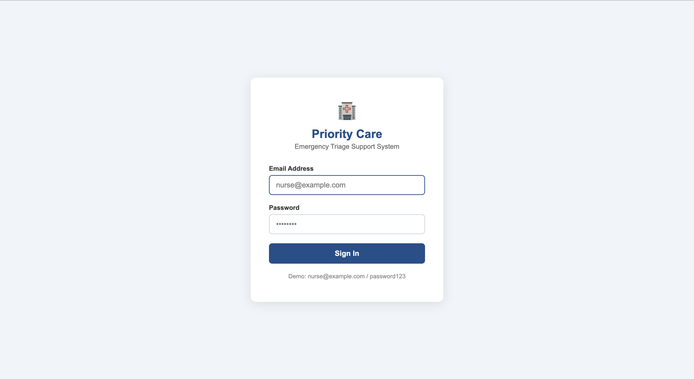
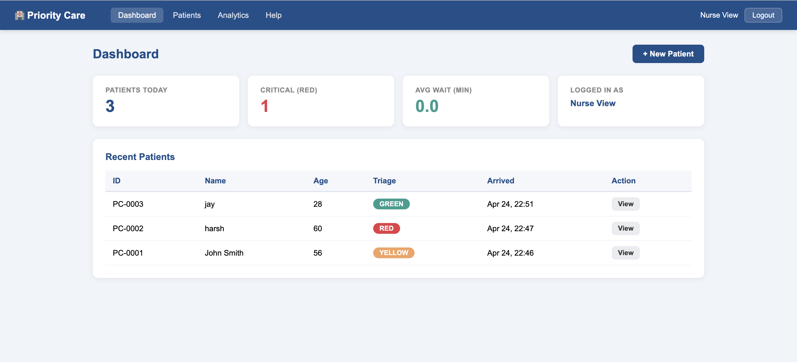
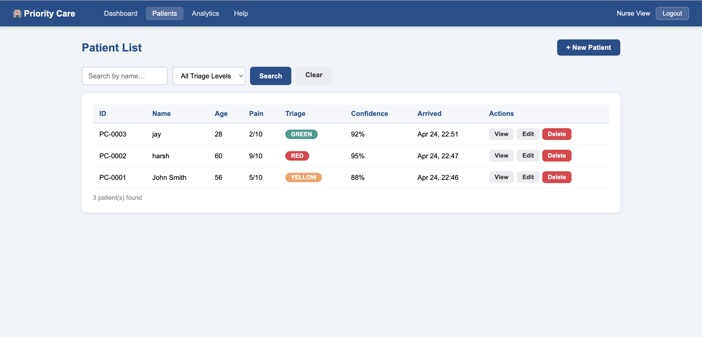
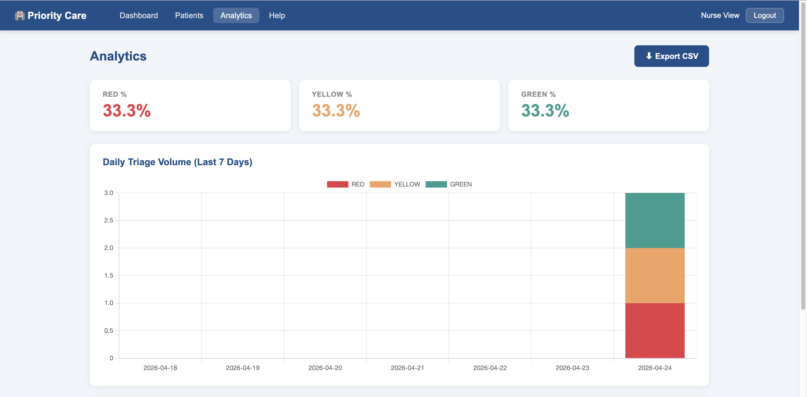
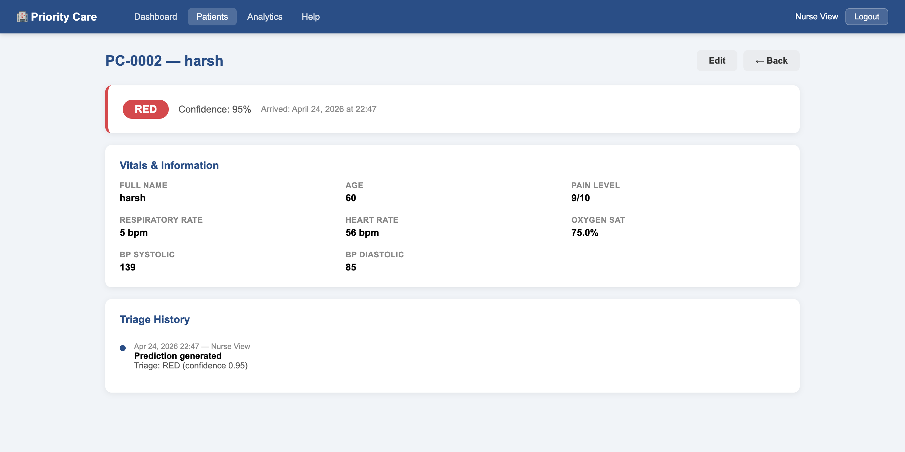
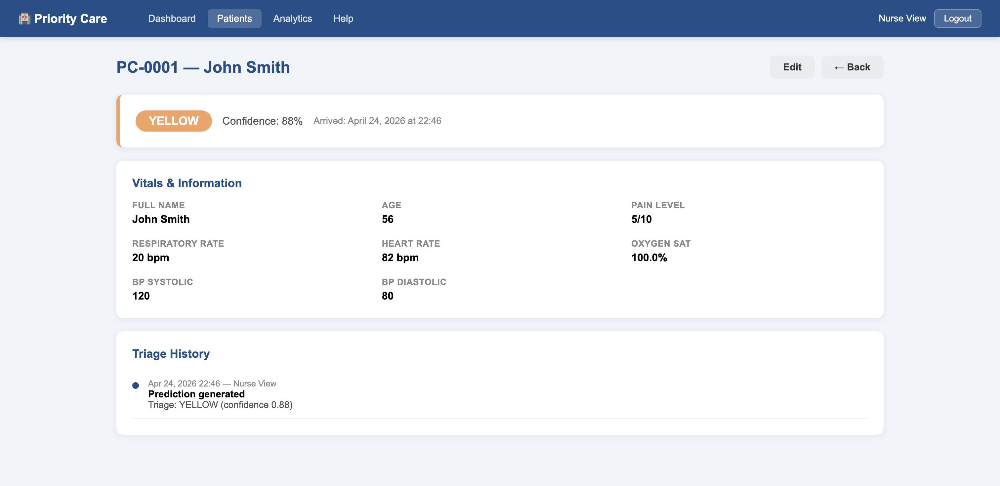
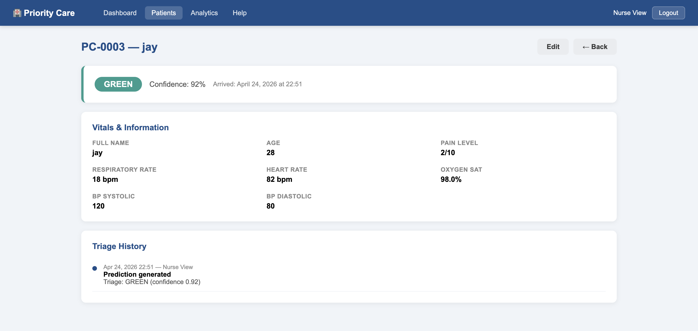

# 🚑 AI Healthcare Triage System (Priority Care)

<p align="center">
  <b>End-to-End AI + Web Application for Patient Triage</b><br>
  Classify patients into <b>RED, YELLOW, GREEN</b> using Machine Learning + Clinical Safety Rules.
</p>

---

## 🌐 Live Demo

👉 **Deployed on Azure App Service**
🔗 https://ai-triage-chintan.azurewebsites.net

> Replace with your actual link after deployment

---

## 👨‍💻 Author

**Chintan Patel**
🔗 GitHub: https://github.com/chintan-02
💼 LinkedIn: https://www.linkedin.com/in/chintan-patel-987765129/

---

## 📌 Project Overview

In emergency healthcare settings, **accurate patient prioritization is critical**.

👉 This project builds an **AI-powered triage system** that:

* Predicts patient urgency level (**RED / YELLOW / GREEN**)
* Uses **Machine Learning (Logistic Regression)**
* Applies **clinical safety override rules**
* Provides **confidence score + decision support**

All presented through a **clean Flask-based dashboard UI**.

---

## ✨ Key Features

✅ Patient triage prediction (RED / YELLOW / GREEN)
✅ Hybrid AI system (**ML + Safety Rules**)
✅ Real-time prediction via Flask
✅ Confidence score for decisions
✅ Patient dashboard & history tracking
✅ Analytics dashboard (triage distribution + trends)
✅ CSV export functionality
✅ Secure login system

---

## 🧠 AI Approach

### 🔹 Machine Learning Model

* Logistic Regression (scikit-learn)
* Trained on:

  * Age
  * Pain Level
  * Respiratory Rate
  * Heart Rate
  * Oxygen Saturation

### 🔹 Safety Override Rules (Critical)

These rules ensure **clinical reliability**:

* Oxygen Saturation ≤ 90 → 🔴 RED
* Pain ≥ 9 → 🔴 RED
* Respiratory Rate ≥ 25 → 🔴 RED
* Critical vitals → 🔴 RED

👉 Ensures **no high-risk patient is misclassified**

---

## 🏗️ Architecture

```
User Input → Safety Rules → ML Model → Prediction → UI Dashboard
```

---

## 📊 Screenshots

### 🔐 Login Page



---

### 🖥️ Dashboard



---

### 📋 Patient List



---

### 📊 Analytics



---

### 🔴 RED Case



---

### 🟡 YELLOW Case



---

### 🟢 GREEN Case



---

## 📁 Project Structure

```
prioritycare/
│
├── app.py              # Flask app + dashboard
├── auth.py             # Authentication routes
├── patients.py         # Patient CRUD + ML prediction
├── analytics.py        # Analytics API + export
├── models.py           # Database models
├── config.py           # App configuration
├── seed.py             # Database seeding
├── requirements.txt
├── Procfile            # Production server (gunicorn)
│
├── ml/
│   ├── predict.py      # ML + safety override logic
│   └── triage_model.pkl
│
├── templates/          # HTML pages
├── static/             # CSS / JS
├── notebooks/          # ML training notebook
├── screenshots/        # UI images
```
---

## ⚙️ Run Locally

```bash
git clone https://github.com/YOUR_USERNAME/ai-healthcare-triage-system.git
cd ai-healthcare-triage-system

python3 -m venv venv
source venv/bin/activate

pip install -r requirements.txt
python seed.py
flask run
```

👉 Open:

```
http://127.0.0.1:5000
```

---

## 🔐 Login Credentials

```
Email: nurse@example.com
Password: password123
```

---

## ☁️ Azure Deployment

This project is deployed using **Azure App Service (Linux)**.

### 🔧 Startup Command

```bash
python seed.py && gunicorn --bind=0.0.0.0:8000 app:app
```

### ⚙️ Environment Variables

| Variable     | Value                     |
| ------------ | ------------------------- |
| SECRET_KEY   | your-secret-key           |
| FLASK_ENV    | production                |
| DATABASE_URL | sqlite:///prioritycare.db |

---

## 🚀 Future Improvements

* Explainable AI (prediction reasoning)
* Advanced models (Random Forest / XGBoost)
* Real-time hospital integration API
* Patient risk scoring system
* Multi-user roles (Admin / Doctor / Nurse)

---

## 📈 Why This Project Stands Out

✔ End-to-end ML + Web integration
✔ Real-world healthcare use case
✔ Hybrid AI (ML + rule-based safety)
✔ Cloud deployment (Azure)
✔ Clean UI/UX + dashboard

---

## ⭐ Final Note

This project demonstrates how **AI can be safely applied in healthcare** by combining machine learning with rule-based safety mechanisms.

---

<p align="center">
  ⭐ If you like this project, give it a star on GitHub!
</p>
